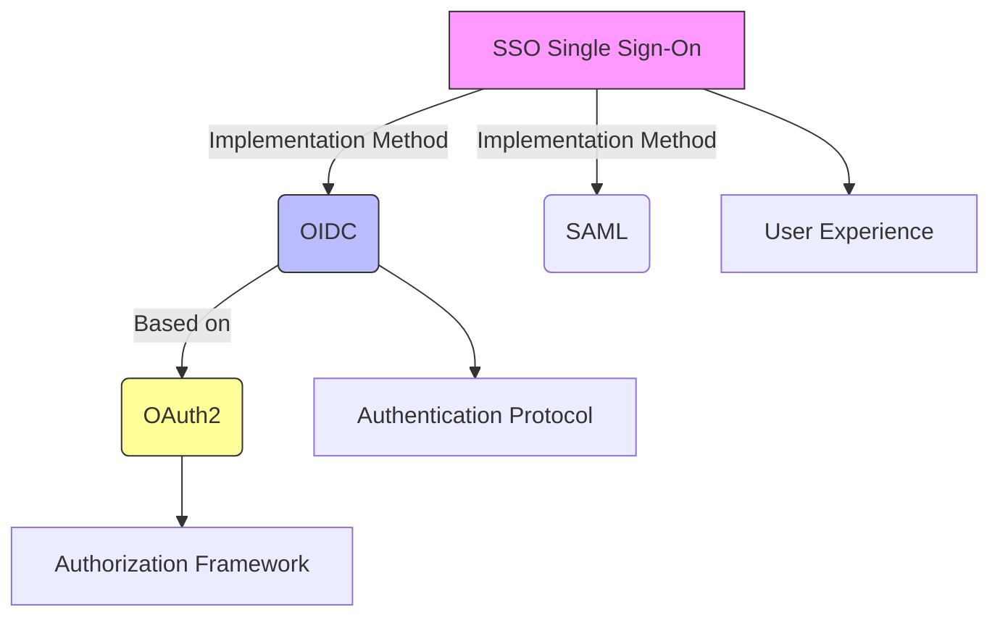
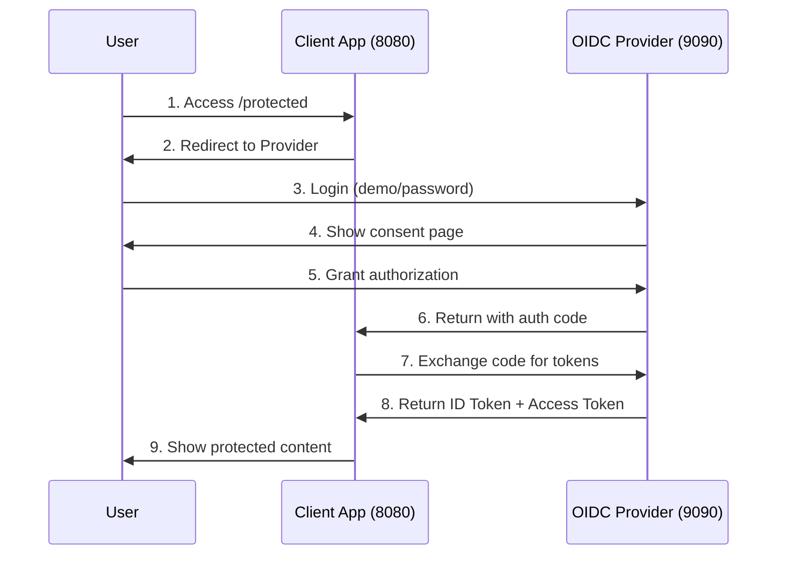
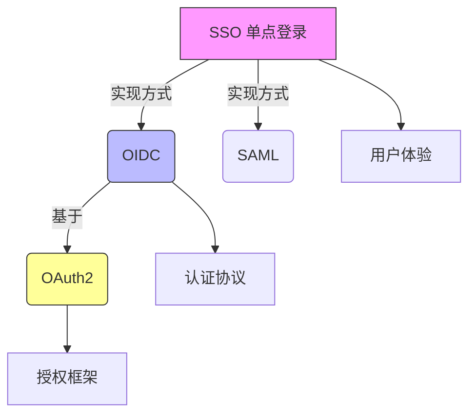
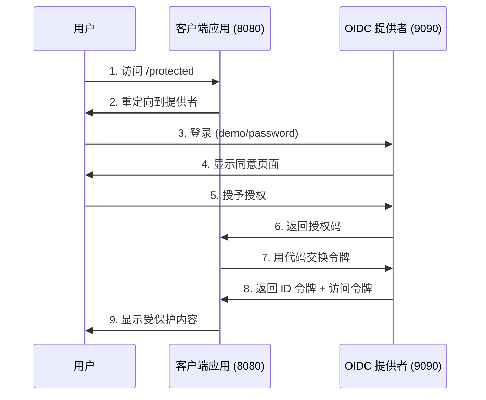

# OIDC Demo Project / OIDC 演示项目

[English](#english) | [中文](#中文)

---

## English

### Overview
This is a comprehensive OpenID Connect (OIDC) demonstration project that showcases the complete authentication flow between an OIDC Provider (Identity Provider) and a Client Application (Relying Party). The project is designed for educational purposes and local development testing.

### Project Structure
```
oidc-project/
├── simple-oidc-provider/     # OIDC Provider (Authentication Server)
│   ├── main.go              # Provider implementation
│   ├── go.mod               # Go module file
│   ├── README.md            # English documentation
│   └── README_zh.md         # Chinese documentation
├── oidc-client-demo/        # OIDC Client (Relying Party)
│   ├── main.go              # Client implementation
│   ├── go.mod               # Go module file
│   ├── README.md            # English documentation
│   └── README_zh.md         # Chinese documentation
└── README.md                # This file
```

### What This Project Demonstrates

#### Core Concepts Relationship


#### Protocol Comparison
| **Aspect**        | **OAuth2**                 | **OIDC**                      | **SSO**                 |
|-------------------|----------------------------|-------------------------------|--------------------------|
| **Purpose**       | Resource authorization     | User authentication           | User experience goal     |
| **Output**        | Access Token               | ID Token + Access Token       | Seamless access          |
| **Information**   | No user identity           | Standardized user claims      | Cross-system sessions    |
| **Use Case**      | API access permission      | User login verification       | Single login experience  |

### Quick Start

#### Prerequisites
- Go 1.21 or higher
- Two terminal windows/tabs

#### Running the Demo

1. **Start the OIDC Provider (Terminal 1)**
   ```bash
   cd simple-oidc-provider
   go mod tidy
   go run main.go
   ```
   The provider will start on `http://127.0.0.1:9090`

2. **Start the Client Application (Terminal 2)**
   ```bash
   cd oidc-client-demo
   go mod tidy
   go run main.go
   ```
   The client will start on `http://127.0.0.1:8080`

3. **Test the Flow**
   - Open browser and visit: `http://127.0.0.1:8080/protected`
   - You'll be redirected to the OIDC provider login page
   - Login with: **Username**: `demo`, **Password**: `password`
   - Grant consent and you'll be redirected back to the client
   - View your authenticated session with user information

### Complete Authentication Flow



### Key Learning Points

1. **OAuth2 Foundation**: Understanding authorization vs authentication
2. **OIDC Extension**: How identity information is standardized
3. **JWT Security**: Token creation, signing, and verification
4. **SSO Implementation**: How single sign-on works in practice
5. **Real-world Integration**: Production-ready patterns and security

### Components

#### OIDC Provider (`simple-oidc-provider/`)
- **Role**: Identity Provider (IdP) / Authorization Server
- **Functionality**: 
  - User authentication
  - Authorization code generation
  - JWT token issuance and signing
  - OIDC discovery and JWKS endpoints
- **Key Features**: RSA-256 signing, in-memory storage, standard OIDC endpoints

#### OIDC Client (`oidc-client-demo/`)
- **Role**: Relying Party (RP) / Client Application
- **Functionality**:
  - User session management
  - OIDC flow initiation
  - Token validation and user info extraction
  - Protected resource serving
- **Key Features**: JWT verification, session management, security best practices

### Security Features Demonstrated

- **PKCE (Proof Key for Code Exchange)**: Enhanced security for public clients
- **State Parameter**: CSRF protection during OAuth2 flow
- **JWT Signature Verification**: Cryptographic token validation
- **Proper Token Handling**: Secure storage and transmission
- **Session Management**: Stateful sessions with stateless tokens

### Production Considerations

This is a **demonstration project**. For production use:

- Replace in-memory storage with databases
- Implement proper password hashing (bcrypt)
- Use HTTPS exclusively
- Add rate limiting and monitoring
- Implement token refresh flows
- Add comprehensive logging and audit trails
- Use proper secret management

### Educational Value

Perfect for:
- Understanding modern authentication protocols
- Learning OIDC implementation patterns
- Grasping OAuth2 vs OIDC differences
- Seeing SSO in action
- Preparing for real-world integrations with providers like Google, Auth0, or Azure AD

---

## 中文

### 概述
这是一个全面的 OpenID Connect (OIDC) 演示项目，展示了 OIDC 提供者（身份提供者）和客户端应用程序（依赖方）之间完整的认证流程。该项目专为教育目的和本地开发测试而设计。

### 项目结构
```
oidc-project/
├── simple-oidc-provider/     # OIDC 提供者（认证服务器）
│   ├── main.go              # 提供者实现
│   ├── go.mod               # Go 模块文件
│   ├── README.md            # 英文文档
│   └── README_zh.md         # 中文文档
├── oidc-client-demo/        # OIDC 客户端（依赖方）
│   ├── main.go              # 客户端实现
│   ├── go.mod               # Go 模块文件
│   ├── README.md            # 英文文档
│   └── README_zh.md         # 中文文档
└── README.md                # 此文件
```

### 项目演示内容

#### 核心概念关系


#### 协议对比
| **方面**          | **OAuth2**                 | **OIDC**                      | **SSO**                 |
|-------------------|----------------------------|-------------------------------|--------------------------|
| **目的**          | 资源授权                   | 用户认证                      | 用户体验目标             |
| **输出**          | 访问令牌                   | ID 令牌 + 访问令牌            | 无缝访问                 |
| **信息**          | 无用户身份信息             | 标准化用户声明                | 跨系统会话               |
| **使用场景**      | API 访问权限               | 用户登录验证                  | 单次登录体验             |

### 快速开始

#### 前置条件
- Go 1.21 或更高版本
- 两个终端窗口/标签页

#### 运行演示

1. **启动 OIDC 提供者（终端 1）**
   ```bash
   cd simple-oidc-provider
   go mod tidy
   go run main.go
   ```
   提供者将在 `http://127.0.0.1:9090` 启动

2. **启动客户端应用（终端 2）**
   ```bash
   cd oidc-client-demo
   go mod tidy
   go run main.go
   ```
   客户端将在 `http://127.0.0.1:8080` 启动

3. **测试流程**
   - 打开浏览器访问：`http://127.0.0.1:8080/protected`
   - 您将被重定向到 OIDC 提供者登录页面
   - 使用以下凭据登录：**用户名**：`demo`，**密码**：`password`
   - 授予同意后您将被重定向回客户端
   - 查看包含用户信息的认证会话

### 完整认证流程



### 关键学习要点

1. **OAuth2 基础**：理解授权与认证的区别
2. **OIDC 扩展**：身份信息如何标准化
3. **JWT 安全**：令牌创建、签名和验证
4. **SSO 实现**：单点登录在实践中的工作原理
5. **真实集成**：生产就绪的模式和安全性

### 组件说明

#### OIDC 提供者 (`simple-oidc-provider/`)
- **角色**：身份提供者 (IdP) / 授权服务器
- **功能**：
  - 用户认证
  - 授权码生成
  - JWT 令牌发放和签名
  - OIDC 发现和 JWKS 端点
- **关键特性**：RSA-256 签名、内存存储、标准 OIDC 端点

#### OIDC 客户端 (`oidc-client-demo/`)
- **角色**：依赖方 (RP) / 客户端应用
- **功能**：
  - 用户会话管理
  - OIDC 流程启动
  - 令牌验证和用户信息提取
  - 受保护资源服务
- **关键特性**：JWT 验证、会话管理、安全最佳实践

### 演示的安全特性

- **PKCE（代码交换证明密钥）**：公共客户端的增强安全性
- **状态参数**：OAuth2 流程中的 CSRF 保护
- **JWT 签名验证**：加密令牌验证
- **适当的令牌处理**：安全存储和传输
- **会话管理**：有状态会话与无状态令牌

### 生产环境考虑

这是一个**演示项目**。生产使用时需要：

- 用数据库替换内存存储
- 实现适当的密码哈希（bcrypt）
- 专门使用 HTTPS
- 添加速率限制和监控
- 实现令牌刷新流程
- 添加全面的日志记录和审计跟踪
- 使用适当的密钥管理

### 教育价值

非常适合：
- 理解现代认证协议
- 学习 OIDC 实现模式
- 掌握 OAuth2 与 OIDC 的区别
- 观察 SSO 的实际运作
- 为与 Google、Auth0 或 Azure AD 等提供商的真实集成做准备

---

## License / 许可证

This project is for educational purposes. Use at your own risk in production environments.

本项目仅用于教育目的。在生产环境中使用需自担风险。

## Contributing / 贡献

Feel free to submit issues and pull requests to improve the educational value of this demo.

欢迎提交问题和拉取请求来改进此演示的教育价值。
