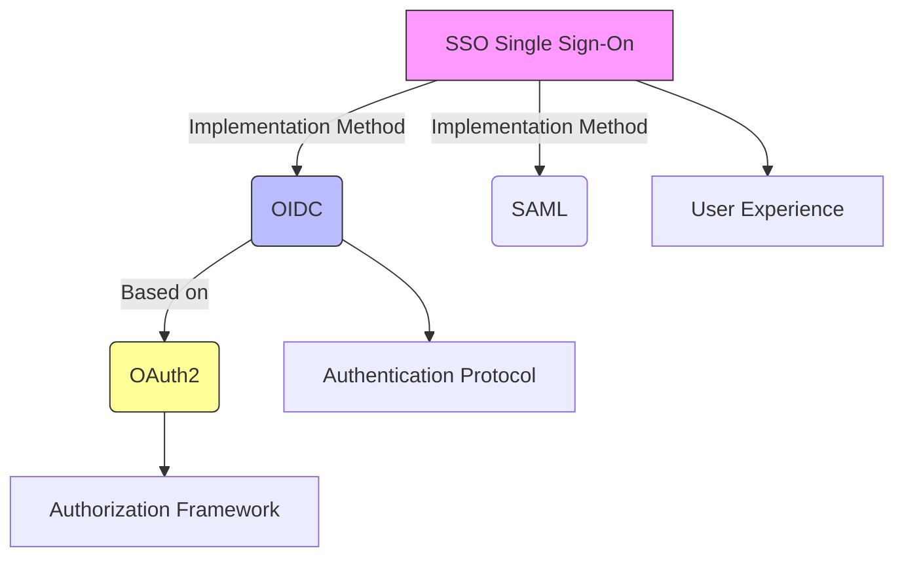
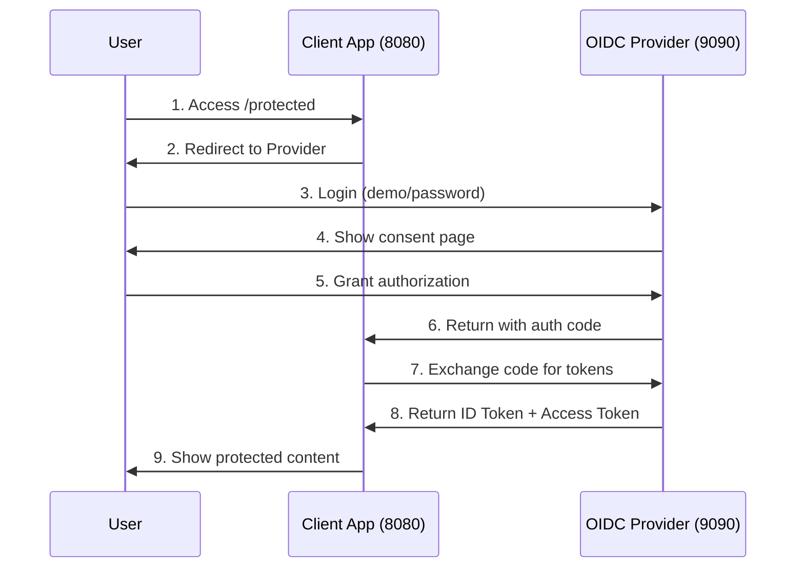
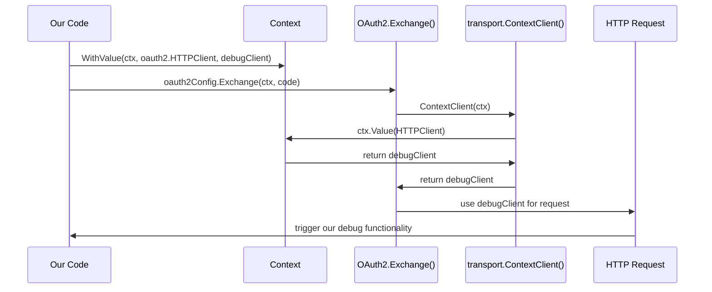
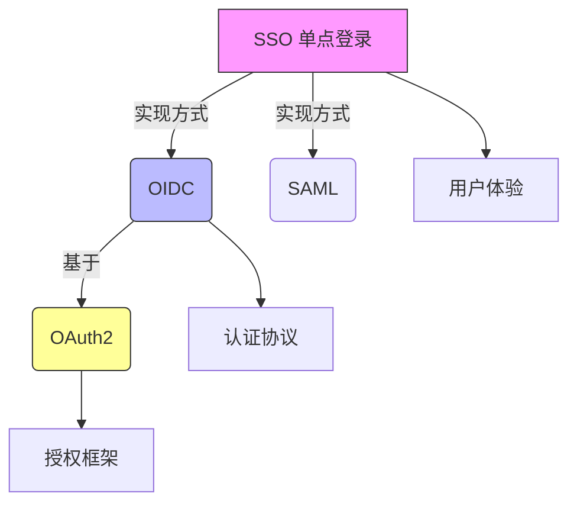
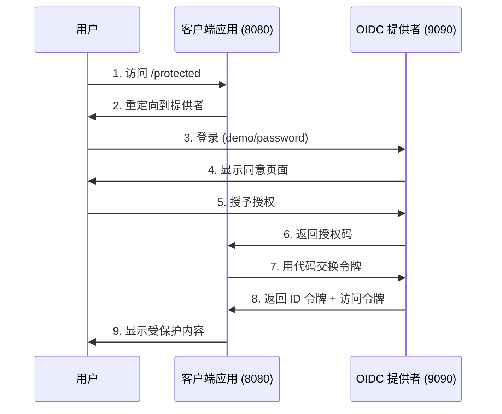

# OIDC Demo Project / OIDC 演示项目

[English](#english) | [中文](#中文)

---

## English

### Overview
This is a comprehensive OpenID Connect (OIDC) demonstration project that showcases the complete authentication flow between an OIDC Provider (Identity Provider) and a Client Application (Relying Party). The project is designed for educational purposes and local development testing.

### Project Structure
```
oidc-project/
├── simple-oidc-provider/     # OIDC Provider (Authentication Server)
│   ├── main.go              # Provider implementation
│   ├── go.mod               # Go module file
│   ├── README.md            # English documentation
│   └── README_zh.md         # Chinese documentation
├── oidc-client-demo/        # OIDC Client (Relying Party)
│   ├── main.go              # Main client logic
│   ├── debug.go             # HTTP request/response debugging module
│   ├── decoder.go           # Smart data format decoder module
│   ├── go.mod               # Go module file
│   ├── README.md            # English documentation
│   └── README_zh.md         # Chinese documentation
├── trace-example.go         # HTTP network tracing example
└── README.md                # This file
```

### What This Project Demonstrates

#### Core Concepts Relationship


#### Protocol Comparison
| **Aspect**        | **OAuth2**                 | **OIDC**                      | **SSO**                 |
|-------------------|----------------------------|-------------------------------|--------------------------|
| **Purpose**       | Resource authorization     | User authentication           | User experience goal     |
| **Output**        | Access Token               | ID Token + Access Token       | Seamless access          |
| **Information**   | No user identity           | Standardized user claims      | Cross-system sessions    |
| **Use Case**      | API access permission      | User login verification       | Single login experience  |

### Quick Start

#### Prerequisites
- Go 1.21 or higher
- Two terminal windows/tabs

#### Running the Demo

1. **Start the OIDC Provider (Terminal 1)**
   ```bash
   cd simple-oidc-provider
   go mod tidy
   go run main.go
   ```
   The provider will start on `http://127.0.0.1:9090`

2. **Start the Client Application (Terminal 2)**
   ```bash
   cd oidc-client-demo
   go mod tidy
   go run main.go
   ```
   The client will start on `http://127.0.0.1:8080`

3. **Test the Flow**
   - Open browser and visit: `http://127.0.0.1:8080/protected`
   - You'll be redirected to the OIDC provider login page
   - Login with: **Username**: `demo`, **Password**: `password`
   - Grant consent and you'll be redirected back to the client
   - View your authenticated session with user information

### Complete Authentication Flow



### Key Learning Points

1. **OAuth2 Foundation**: Understanding authorization vs authentication
2. **OIDC Extension**: How identity information is standardized
3. **JWT Security**: Token creation, signing, and verification
4. **SSO Implementation**: How single sign-on works in practice
5. **Real-world Integration**: Production-ready patterns and security

### Components

#### OIDC Provider (`simple-oidc-provider/`)
- **Role**: Identity Provider (IdP) / Authorization Server
- **Functionality**: 
  - User authentication
  - Authorization code generation
  - JWT token issuance and signing
  - OIDC discovery and JWKS endpoints
- **Key Features**: RSA-256 signing, in-memory storage, standard OIDC endpoints

#### OIDC Client (`oidc-client-demo/`)
- **Role**: Relying Party (RP) / Client Application
- **Functionality**:
  - User session management
  - OIDC flow initiation
  - Token validation and user info extraction
  - Protected resource serving
- **Key Features**: JWT verification, session management, security best practices

### Security Features Demonstrated

- **PKCE (Proof Key for Code Exchange)**: Enhanced security for public clients
- **State Parameter**: CSRF protection during OAuth2 flow
- **JWT Signature Verification**: Cryptographic token validation
- **Proper Token Handling**: Secure storage and transmission
- **Session Management**: Stateful sessions with stateless tokens

### Production Considerations

This is a **demonstration project**. For production use:

- Replace in-memory storage with databases
- Implement proper password hashing (bcrypt)
- Use HTTPS exclusively
- Add rate limiting and monitoring
- Implement token refresh flows
- Add comprehensive logging and audit trails
- Use proper secret management

### Advanced Go Concepts: Context in HTTP Debugging

This project demonstrates sophisticated usage of Go's `context` package for HTTP debugging and dependency injection:

#### Context Fundamentals
```go
type Context interface {
    Deadline() (deadline time.Time, ok bool)
    Done() <-chan struct{}
    Err() error
    Value(key interface{}) interface{}
}
```

#### HTTP Client Injection via Context
The project shows how OAuth2 libraries accept custom HTTP clients through context:

```go
// Custom HTTP client with debugging transport
client := &http.Client{
    Transport: NewDebugTransport(),
}

// Inject client via context
ctx := context.WithValue(context.Background(), oauth2.HTTPClient, client)

// OAuth2 library will use our custom client
token, err := oauth2Config.Exchange(ctx, code)
```

#### 🔍 OAuth2 Library Internal Implementation Tracking

By diving deep into the OAuth2 library source code, we discovered the key location where Context flows:

**File Path**: `golang.org/x/oauth2@v0.30.0/internal/transport.go`

```go
// HTTPClient is the context key to use with context.WithValue
var HTTPClient ContextKey

// ContextKey ensures key uniqueness and immutability
type ContextKey struct{}

// 🎯 Key function: Extract HTTP client from context
func ContextClient(ctx context.Context) *http.Client {
    if ctx != nil {
        // ⭐ This is where Context.Value() method is actually called!
        if hc, ok := ctx.Value(HTTPClient).(*http.Client); ok {
            return hc  // Return our injected debug client
        }
    }
    return http.DefaultClient  // Fallback to default client
}
```

#### 🔄 Complete Context Flow Chain



#### 💡 Key Design Analysis

1. **ContextKey's Clever Design**:
   ```go
   type ContextKey struct{}
   ```
   - **Uniqueness**: Only OAuth2 library can create this type
   - **Immutability**: External packages cannot modify the key
   - **Memory Efficiency**: Empty struct uses no memory
   - **Type Safety**: Avoids string key collisions

2. **Actual Usage of Value() Method**:
   ```go
   // This is where Context interface's Value() method gets called!
   if hc, ok := ctx.Value(HTTPClient).(*http.Client); ok {
       return hc
   }
   ```

3. **Graceful Fallback Mechanism**:
   - If custom client found → Use debug functionality
   - If not found → Use default client
   - Ensures backward compatibility

#### Key Benefits in HTTP Debugging

1. **Non-intrusive Debugging**: Add HTTP tracing without modifying core business logic
2. **Dependency Injection**: Pass custom HTTP clients, timeouts, or configuration through context
3. **Request Correlation**: Track requests across multiple service calls
4. **Graceful Cancellation**: Handle timeouts and user cancellations properly

#### Practical Implementation
The `debug.go` module demonstrates:
- Custom `http.RoundTripper` implementation
- Request/response logging with proper formatting
- Integration with Go's `httptrace` package for network-level debugging
- Context-aware HTTP client configuration

#### Best Practices
- Use typed context keys to avoid collisions
- Always handle context cancellation in long-running operations
- Keep context values immutable and lightweight
- Use context for request-scoped data, not application configuration

### Educational Value

Perfect for:
- Understanding modern authentication protocols
- Learning OIDC implementation patterns
- Grasping OAuth2 vs OIDC differences
- Seeing SSO in action
- Mastering Go context patterns for HTTP debugging
- Learning dependency injection in Go
- Preparing for real-world integrations with providers like Google, Auth0, or Azure AD

---

## 中文

### 概述
这是一个全面的 OpenID Connect (OIDC) 演示项目，展示了 OIDC 提供者（身份提供者）和客户端应用程序（依赖方）之间完整的认证流程。该项目专为教育目的和本地开发测试而设计。

### 🎯 项目特色

1. **📚 深度教学**: 详细注释每行关键代码，适合学习 OIDC/OAuth2 原理
2. **🔍 网络调试**: 集成强大的 HTTP 请求追踪和响应解码功能
3. **🧩 模块化设计**: 调试和解码功能独立封装，代码结构清晰
4. **🌐 双语文档**: 完整的中英文说明文档
5. **🛡️ 安全示范**: 演示 state 验证、CSRF 防护、JWT 验证等安全最佳实践
6. **🎨 智能解码**: 自动识别并美观展示 JSON、JWT、URL 编码等多种数据格式

### 项目结构
```
oidc-project/
├── simple-oidc-provider/     # OIDC 提供者（认证服务器）
│   ├── main.go              # 提供者实现
│   ├── go.mod               # Go 模块文件
│   ├── README.md            # 英文文档
│   └── README_zh.md         # 中文文档
├── oidc-client-demo/        # OIDC 客户端（依赖方）
│   ├── main.go              # 主要客户端逻辑
│   ├── debug.go             # HTTP 请求/响应调试模块
│   ├── decoder.go           # 智能数据格式解码模块
│   ├── go.mod               # Go 模块文件
│   ├── README.md            # 英文文档
│   └── README_zh.md         # 中文文档
├── trace-example.go         # HTTP 网络追踪示例
└── README.md                # 此文件
```

### 项目演示内容

#### 核心概念关系


#### 协议对比
| **方面**          | **OAuth2**                 | **OIDC**                      | **SSO**                 |
|-------------------|----------------------------|-------------------------------|--------------------------|
| **目的**          | 资源授权                   | 用户认证                      | 用户体验目标             |
| **输出**          | 访问令牌                   | ID 令牌 + 访问令牌            | 无缝访问                 |
| **信息**          | 无用户身份信息             | 标准化用户声明                | 跨系统会话               |
| **使用场景**      | API 访问权限               | 用户登录验证                  | 单次登录体验             |

### 快速开始

#### 前置条件
- Go 1.21 或更高版本
- 两个终端窗口/标签页

#### 运行演示

1. **启动 OIDC 提供者（终端 1）**
   ```bash
   cd simple-oidc-provider
   go mod tidy
   go run main.go
   ```
   提供者将在 `http://127.0.0.1:9090` 启动

2. **启动客户端应用（终端 2）**
   ```bash
   cd oidc-client-demo
   go mod tidy
   go run main.go
   ```
   客户端将在 `http://127.0.0.1:8080` 启动

3. **测试流程**
   - 打开浏览器访问：`http://127.0.0.1:8080/protected`
   - 您将被重定向到 OIDC 提供者登录页面
   - 使用以下凭据登录：**用户名**：`demo`，**密码**：`password`
   - 授予同意后您将被重定向回客户端
   - 查看包含用户信息的认证会话

### 完整认证流程



### 关键学习要点

1. **OAuth2 基础**：理解授权与认证的区别
2. **OIDC 扩展**：身份信息如何标准化
3. **JWT 安全**：令牌创建、签名和验证
4. **SSO 实现**：单点登录在实践中的工作原理
5. **真实集成**：生产就绪的模式和安全性

### 高级 Go 概念：Context 在 HTTP 调试中的应用

本项目演示了 Go `context` 包在 HTTP 调试和依赖注入中的高级用法：

#### Context 基础原理
```go
type Context interface {
    Deadline() (deadline time.Time, ok bool)  // 超时时间
    Done() <-chan struct{}                    // 取消信号
    Err() error                               // 错误信息
    Value(key interface{}) interface{}        // 键值存储
}
```

#### 通过 Context 注入 HTTP 客户端
项目展示了 OAuth2 库如何通过 context 接受自定义 HTTP 客户端：

```go
// 带调试传输层的自定义 HTTP 客户端
client := &http.Client{
    Transport: NewDebugTransport(),
}

// 通过 context 注入客户端
ctx := context.WithValue(context.Background(), oauth2.HTTPClient, client)

// OAuth2 库将使用我们的自定义客户端
token, err := oauth2Config.Exchange(ctx, code)
```

#### HTTP 调试的关键优势

1. **无侵入式调试**：无需修改核心业务逻辑即可添加 HTTP 追踪
2. **依赖注入**：通过 context 传递自定义 HTTP 客户端、超时或配置
3. **请求关联**：跨多个服务调用追踪请求
4. **优雅取消**：正确处理超时和用户取消操作

#### 实际实现
`debug.go` 模块演示了：
- 自定义 `http.RoundTripper` 实现
- 带格式化的请求/响应日志记录
- 与 Go `httptrace` 包集成进行网络级调试
- 上下文感知的 HTTP 客户端配置

#### 最佳实践
- 使用类型化的 context 键避免冲突
- 在长时间运行的操作中始终处理 context 取消
- 保持 context 值不可变且轻量级
- 将 context 用于请求范围的数据，而非应用程序配置

### 组件说明

#### OIDC 提供者 (`simple-oidc-provider/`)
- **角色**：身份提供者 (IdP) / 授权服务器
- **功能**：
  - 用户认证
  - 授权码生成
  - JWT 令牌发放和签名
  - OIDC 发现和 JWKS 端点
- **关键特性**：RSA-256 签名、内存存储、标准 OIDC 端点

#### OIDC 客户端 (`oidc-client-demo/`)
- **角色**：依赖方 (RP) / 客户端应用
- **功能**：
  - 用户会话管理
  - OIDC 流程启动
  - 令牌验证和用户信息提取
  - 受保护资源服务
- **关键特性**：JWT 验证、会话管理、安全最佳实践

### 演示的安全特性

- **PKCE（代码交换证明密钥）**：公共客户端的增强安全性
- **状态参数**：OAuth2 流程中的 CSRF 保护
- **JWT 签名验证**：加密令牌验证
- **适当的令牌处理**：安全存储和传输
- **会话管理**：有状态会话与无状态令牌

### 生产环境考虑

这是一个**演示项目**。生产使用时需要：

- 用数据库替换内存存储
- 实现适当的密码哈希（bcrypt）
- 专门使用 HTTPS
- 添加速率限制和监控
- 实现令牌刷新流程
- 添加全面的日志记录和审计跟踪
- 使用适当的密钥管理

### 教育价值

非常适合：
- 理解现代认证协议
- 学习 OIDC 实现模式
- 掌握 OAuth2 与 OIDC 的区别
- 观察 SSO 的实际运作
- 为与 Google、Auth0 或 Azure AD 等提供商的真实集成做准备

---

## License / 许可证

This project is for educational purposes. Use at your own risk in production environments.

本项目仅用于教育目的。在生产环境中使用需自担风险。

## Contributing / 贡献

Feel free to submit issues and pull requests to improve the educational value of this demo.

欢迎提交问题和拉取请求来改进此演示的教育价值。


---

# 流程解读

好的，我们来详细解析您提供的这两段Go代码所实现的、一个完整的OIDC（OpenID Connect）认证周期。

这个流程被称为 **OIDC授权码流程 (Authorization Code Flow)**，是Web应用登录最标准、最安全的方式。下面我将分步骤拆解，并明确指出每一步对应的是哪个文件中的哪个函数。

### 参与者定义

* **用户 (User)**: 正在使用浏览器的真人。
* **用户浏览器 (Browser)**: Chrome, Firefox等，作为用户和两个后台服务之间的媒介。
* **客户端应用 (RP)**: `oidc-demo/main.go`，运行在 `http://127.0.0.1:8080`。
* **认证服务 (OP)**: `simple-oidc-provider/main.go`，运行在 `http://127.0.0.1:9090`。

---

### 完整认证周期（Step-by-Step）

下面是用户从点击登录到成功看到欢迎页面的完整旅程：

#### 第 1 步：用户发起登录

* **动作**: 用户在浏览器中打开 `http://127.0.0.1:8080`。
* **代码执行**:
    1.  浏览器向 **客户端应用(RP)** 发起 `GET /` 请求。
    2.  `oidc-demo` 中的 `handleHome` 函数被调用。
    3.  `r.Cookie("user-info")` 找不到Cookie，因此返回一个包含“登录”按钮的HTML页面。
* **动作**: 用户点击“使用我们的认证服务登录”按钮。
* **代码执行**:
    1.  浏览器向 **客户端应用(RP)** 发起 `GET /login` 请求。
    2.  `oidc-demo` 中的 `handleLogin` 函数被调用。
    3.  **核心操作**:
        * 生成一个随机的`state`字符串用于防止CSRF攻击。
        * 将`state`存入一个有时效性的Cookie。
        * 调用 `oauth2Config.AuthCodeURL(state)` 生成一个指向**认证服务(OP)** 的URL。
        * 通过 `http.Redirect` 将用户的**浏览器**重定向到这个URL。

#### 第 2 步：在认证服务上进行认证和授权

* **动作**: 用户的浏览器被重定向到 `http://127.0.0.1:9090/authorize?...`，页面上显示出登录框。
* **代码执行**:
    1.  **认证服务(OP)** 的 `handleAuthorize` 函数被调用。它会验证URL中的`client_id`等信息是否合法。
    2.  验证通过后，它将请求“转发”给 `handleLoginPage` 函数。
    3.  `handleLoginPage` 函数返回登录页面的HTML。
* **动作**: 用户输入用户名 `demo` 和密码 `password`，点击“登录”。
* **代码执行**:
    1.  浏览器向 **认证服务(OP)** 发起 `POST /login?...` 请求。
    2.  `handleLoginPage` 函数处理 `POST` 请求，验证用户名密码是否与 `users` map中的匹配。
    3.  验证成功后，通过 `http.Redirect` 将用户的浏览器重定向到 `/consent` 页面。
* **动作**: 用户看到授权请求页面，点击“同意授权”。
* **代码执行**:
    1.  `handleConsentPage` 函数被调用，显示授权信息。
    2.  用户点击同意后，浏览器向 **认证服务(OP)** 发起 `POST /consent?...` 请求。
    3.  `handleConsentPage` 函数处理 `POST` 请求。
    4.  **核心操作**:
        * 生成一个唯一的**授权码(Authorization Code)**。
        * 将这个`code`与`clientID`、`userID`和过期时间一起存入 `authCodes` map中。
        * 通过 `http.Redirect` 将用户的**浏览器**重定向回**客户端应用(RP)** 的回调URL (`redirectURL`)，并附上`code`和`state`。

#### 第 3 步：后台交换令牌（用户无感知）

* **动作**: 用户的浏览器被重定向到 `http://127.0.0.1:8080/auth/callback?code=...&state=...`。
* **代码执行**:
    1.  **客户端应用(RP)** 的 `handleCallback` 函数被调用。
    2.  它首先从Cookie中取出`state`与URL中的`state`进行比较，以确保请求的合法性。
    3.  **核心操作 (后台到后台的通信)**:
        * 调用 `oauth2Config.Exchange(ctx, code)`。这个函数会在**后台**向**认证服务(OP)** 的 `/token` 端点发起一个`POST`请求。这个请求中包含了`code`、`client_id`和`client_secret`。
* **代码执行 (在认证服务OP侧)**:
    1.  **认证服务(OP)** 的 `handleToken` 函数被调用。
    2.  它会验证`client_secret`、`code`的有效性（是否存在、是否过期）。
    3.  验证通过后，它会删除这个`code`（因为授权码只能使用一次）。
    4.  **核心操作**:
        * 使用 `privateKey` 创建并签名一个包含用户身份信息（`iss`, `sub`, `aud`, `exp`, `name`, `email`等）的 **ID Token (JWT格式)**。
        * 将 `ID Token` 和一个 `Access Token` 包装在JSON中返回给**客户端应用(RP)**。

#### 第 4 步：令牌验证与会话创建

* **动作**: **客户端应用(RP)** 的后台收到了包含 `ID Token` 的JSON响应。
* **代码执行**:
    1.  回到 `oidc-demo` 的 `handleCallback` 函数，`oauth2Config.Exchange` 调用成功返回。
    2.  从返回的 `oauth2Token` 中提取出 `rawIDToken` (原始的JWT字符串)。
    3.  **核心安全操作**:
        * 调用 `idTokenVerifier.Verify(ctx, rawIDToken)`。
        * 这个 `Verify` 函数内部会自动连接到 **认证服务(OP)** 的 `/jwks.json` 端点获取公钥，然后用公钥验证`ID Token`的签名。同时，它还会检查`iss` (颁发者)、`aud` (受众)、`exp` (有效期)等声明是否正确。
    4.  验证成功后，`idToken.Claims(&claims)` 将JWT中的用户信息解析到`UserInfo`结构体中。
    5.  **核心操作**:
        * 将`UserInfo`序列化为JSON，再编码为Base64字符串。
        * 通过 `http.SetCookie` 将这个字符串存入名为 `user-info` 的会话Cookie中。
        * 通过 `http.Redirect` 将用户的**浏览器**重定向到主页 `/`。

#### 第 5 步：登录完成，维持会话

* **动作**: 用户浏览器被重定向到 `http://127.0.0.1:8080`。
* **代码执行**:
    1.  浏览器再次向 **客户端应用(RP)** 发起 `GET /` 请求，但这次请求**会带上 `user-info` Cookie**。
    2.  `handleHome` 函数被调用，`r.Cookie("user-info")` 成功获取到Cookie。
    3.  程序解码Cookie中的信息，并返回包含用户姓名、邮箱和头像的欢迎页面。
* **至此，一个完整的认证周期结束。**

#### 登出周期

* **动作**: 用户点击“退出登录”。
* **代码执行**:
    1.  浏览器向 **客户端应用(RP)** 发起 `GET /logout` 请求。
    2.  `handleLogout` 函数被调用。
    3.  它通过设置一个同名但已过期的Cookie来**清除本地会话**。
    4.  将用户重定向回主页 `/`，用户变回未登录状态。

---
### 流程总结

整个周期可以概括为一系列精心设计的**重定向**和一次关键的**后台API调用**：

1.  **前端重定向 (用户参与)**: 客户端 -> 认证服务 -> 客户端回调
2.  **后台交换 (用户无感知)**: 客户端 -> 认证服务 -> 客户端
3.  **前端再次重定向 (用户参与)**: 客户端回调 -> 最终主页

这个流程将用户的凭据（密码）牢牢地隔离在**认证服务(OP)** 内部，客户端应用自始至终都接触不到用户的密码，同时通过ID Token和严格的验证流程，安全、可靠地确认了用户的身份。