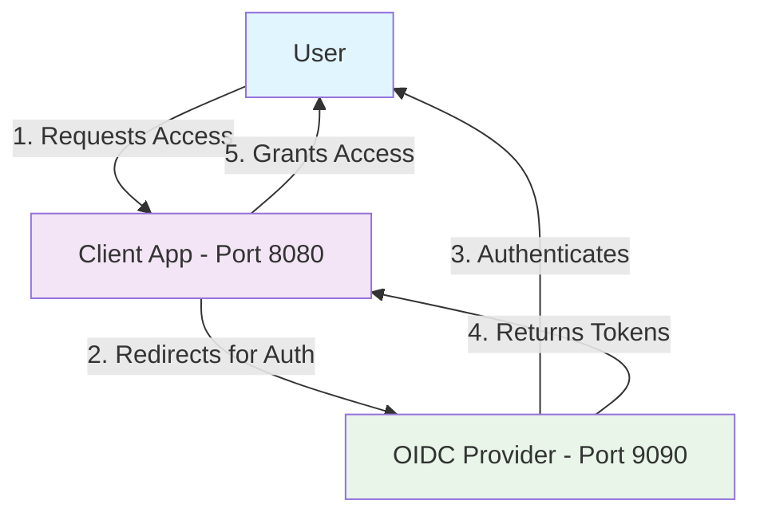
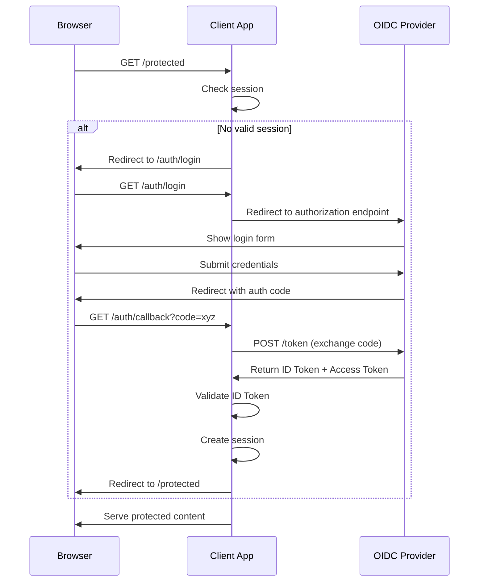

# OIDC Client Demo - Relying Party Application

## Overview
This is a demonstration client application (Relying Party) that integrates with the OIDC Provider to showcase how modern web applications implement authentication using OpenID Connect. It demonstrates the complete user authentication flow from the client perspective.

## Core Concepts in Action

### The Authentication Triangle


### OAuth2 vs OIDC vs SSO - What This Demo Shows

#### OAuth2 Layer (Authorization)
- **What it answers**: "Can this app access user resources?"
- **Demo demonstrates**: 
  - Authorization code exchange
  - Access token usage
  - Secure redirect handling

#### OIDC Layer (Authentication) 
- **What it answers**: "Who is this user?"
- **Demo demonstrates**:
  - ID Token validation
  - JWT signature verification
  - User claims extraction

#### SSO Experience (User Journey)
- **What it provides**: "Login once, access everywhere"
- **Demo demonstrates**:
  - Seamless authentication redirect
  - Automatic session establishment
  - User-friendly login experience

## Technical Architecture

### Client-Side Implementation Pattern


### Key Components

#### 1. Authentication Middleware
- Session management
- Token validation
- Automatic OIDC redirects

#### 2. Token Handling
- **ID Token Validation**:
  - Signature verification using JWKS
  - Issuer (`iss`) validation
  - Audience (`aud`) validation
  - Expiration (`exp`) checking

#### 3. Callback Processing
- Authorization code reception
- Token exchange with provider
- User session establishment

## Quick Start

### Prerequisites
- Go 1.21 or higher
- OIDC Provider running on port 9090 (see `../simple-oidc-provider/`)

### Installation & Run
```bash
cd oidc-client-demo
go mod tidy
go run main.go
```

The client will start on `http://127.0.0.1:8080`

### Default Configuration
```go
oidcConfig := OIDCConfig{
    ClientID:     "my-client-app",
    ClientSecret: "my-client-secret",
    RedirectURI:  "http://127.0.0.1:8080/auth/callback",
    ProviderURL:  "http://127.0.0.1:9090",
}
```

## User Journey Demonstration

### Step-by-Step Flow
1. **Access Protected Resource**: Visit `http://127.0.0.1:8080/protected`
2. **Automatic Redirect**: Browser redirects to OIDC provider login
3. **User Authentication**: Enter credentials (demo/password)
4. **Consent Grant**: Approve application access
5. **Return to Client**: Automatic redirect back with tokens
6. **Access Granted**: View protected content with user information

### What You'll See
- **Login Page**: OIDC provider's authentication interface
- **Consent Screen**: Permission grant for client application
- **Protected Page**: User profile information from ID Token
- **Session Management**: Persistent login across page refreshes

## Educational Features

### 1. Real OIDC Implementation
Demonstrates production-ready patterns:
- Proper state parameter usage (CSRF protection)
- Secure token storage
- JWT validation best practices

### 2. Security Demonstrations
Shows critical security measures:
- **PKCE Flow**: Proof Key for Code Exchange (recommended for SPAs)
- **State Validation**: Prevents CSRF attacks
- **Nonce Checking**: Prevents replay attacks
- **Token Verification**: Cryptographic signature validation

### 3. Error Handling
Includes proper error scenarios:
- Invalid authorization codes
- Expired tokens
- Network failures
- Malformed responses

## API Routes

| Route | Method | Purpose | Authentication |
|-------|--------|---------|----------------|
| `/` | GET | Home page | None |
| `/protected` | GET | Protected resource | Required |
| `/auth/login` | GET | Initiate OIDC flow | None |
| `/auth/callback` | GET | Handle OIDC response | None |
| `/auth/logout` | GET | Clear session | None |
| `/profile` | GET | User profile page | Required |

## Configuration Options

### Environment Variables
```bash
export OIDC_CLIENT_ID="your-client-id"
export OIDC_CLIENT_SECRET="your-client-secret"
export OIDC_PROVIDER_URL="https://your-provider.com"
export OIDC_REDIRECT_URI="http://localhost:8080/auth/callback"
```

### Custom Provider Integration
To integrate with other OIDC providers (Google, Auth0, etc.):
```go
// Update provider discovery URL
ProviderURL: "https://accounts.google.com"

// Or specify endpoints directly
AuthorizationEndpoint: "https://accounts.google.com/o/oauth2/v2/auth"
TokenEndpoint: "https://oauth2.googleapis.com/token"
JWKSEndpoint: "https://www.googleapis.com/oauth2/v3/certs"
```

## Key Learning Points

### 1. Protocol Understanding
- **Authorization vs Authentication**: OAuth2 handles "what can you do", OIDC handles "who are you"
- **Token Types**: Access tokens for API access, ID tokens for identity
- **Security Model**: Why signatures and validation matter

### 2. Integration Patterns
- **Discovery Protocol**: How clients find provider endpoints
- **Dynamic Configuration**: Adapting to different OIDC providers
- **Session Management**: Bridging stateless tokens with stateful sessions

### 3. User Experience
- **Seamless Redirects**: Invisible authentication flow
- **Error Recovery**: Graceful handling of auth failures
- **Logout Handling**: Proper session termination

## Testing & Development

### Local Testing
1. Start OIDC Provider: `cd ../simple-oidc-provider && go run main.go`
2. Start Client: `go run main.go`
3. Test flow: Visit `http://127.0.0.1:8080/protected`

### Integration with Real Providers
This client can be configured to work with:
- Google Identity Platform
- Auth0
- Microsoft Azure AD
- Okta
- Any compliant OIDC provider

### Debugging Tips
- Check browser network tab for redirect flows
- Validate JWT tokens at [jwt.io](https://jwt.io)
- Monitor provider discovery endpoint responses
- Verify JWKS public key matching

## Production Considerations

### Security Enhancements
- **HTTPS Only**: Never run OIDC over HTTP in production
- **Secure Cookies**: HTTPOnly, Secure, SameSite attributes
- **PKCE Implementation**: Enhanced security for public clients
- **Token Refresh**: Implement refresh token flow

### Scalability Features
- **Distributed Sessions**: Redis or database-backed sessions
- **Token Caching**: Cache JWKS keys and discovery metadata
- **Load Balancing**: Session affinity considerations

### Monitoring & Observability
- Authentication success/failure rates
- Token validation errors
- Provider response times
- User authentication patterns

This demo provides a complete foundation for understanding and implementing OIDC authentication in modern web applications, bridging the gap between OAuth2 authorization and SSO user experience.
