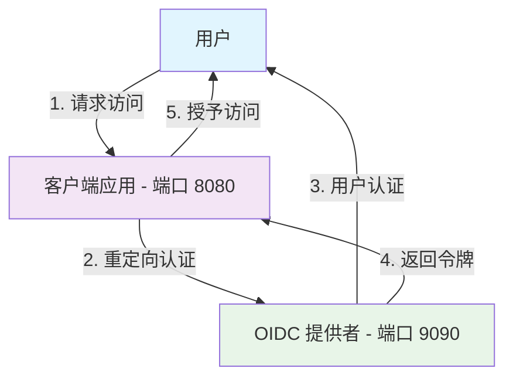
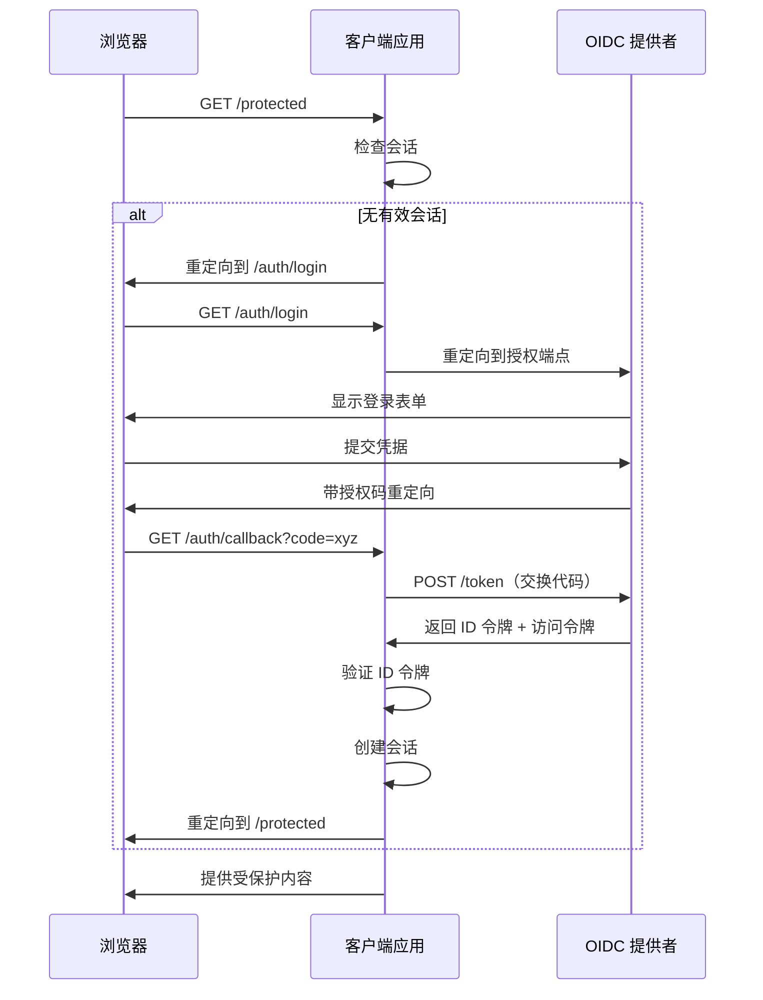

# OIDC 客户端演示 - 依赖方应用程序

## 概述
这是一个演示客户端应用程序（依赖方），它与 OIDC 提供者集成，展示现代 Web 应用程序如何使用 OpenID Connect 实现身份认证。它从客户端角度演示了完整的用户认证流程。

## 核心概念实战

### 认证三角关系


### OAuth2 vs OIDC vs SSO - 此演示展示的内容

#### OAuth2 层（授权）
- **回答的问题**："此应用可以访问用户资源吗？"
- **演示内容**：
  - 授权码交换
  - 访问令牌使用
  - 安全重定向处理

#### OIDC 层（身份认证）
- **回答的问题**："这个用户是谁？"
- **演示内容**：
  - ID 令牌验证
  - JWT 签名验证
  - 用户声明提取

#### SSO 体验（用户旅程）
- **提供的功能**："一次登录，处处访问"
- **演示内容**：
  - 无缝认证重定向
  - 自动会话建立
  - 用户友好的登录体验

## 技术架构

### 客户端实现模式


### 关键组件

#### 1. 认证中间件
- 会话管理
- 令牌验证
- 自动 OIDC 重定向

#### 2. 令牌处理
- **ID 令牌验证**：
  - 使用 JWKS 进行签名验证
  - 颁发者（`iss`）验证
  - 受众（`aud`）验证
  - 过期时间（`exp`）检查

#### 3. 回调处理
- 授权码接收
- 与提供者的令牌交换
- 用户会话建立

## 快速开始

### 前置条件
- Go 1.21 或更高版本
- OIDC 提供者运行在 9090 端口（参见 `../simple-oidc-provider/`）

### 安装和运行
```bash
cd oidc-client-demo
go mod tidy
go run main.go
```

客户端将在 `http://127.0.0.1:8080` 启动

### 默认配置
```go
oidcConfig := OIDCConfig{
    ClientID:     "my-client-app",
    ClientSecret: "my-client-secret",
    RedirectURI:  "http://127.0.0.1:8080/auth/callback",
    ProviderURL:  "http://127.0.0.1:9090",
}
```

## 用户旅程演示

### 分步流程
1. **访问受保护资源**：访问 `http://127.0.0.1:8080/protected`
2. **自动重定向**：浏览器重定向到 OIDC 提供者登录页面
3. **用户认证**：输入凭据（demo/password）
4. **同意授权**：批准应用程序访问
5. **返回客户端**：携带令牌自动重定向回客户端
6. **授予访问**：查看包含用户信息的受保护内容

### 您将看到的内容
- **登录页面**：OIDC 提供者的认证界面
- **同意屏幕**：客户端应用程序的权限授予
- **受保护页面**：来自 ID 令牌的用户配置信息
- **会话管理**：页面刷新时的持久登录

## 高级 Go 编程概念

### Context 在 HTTP 调试中的应用

本客户端演示了使用 Go `context` 包进行 HTTP 调试和依赖注入的高级编程模式：

#### Context 如何驱动 OAuth2 调试

项目展示了 OAuth2 库如何通过 context 接受自定义 HTTP 客户端：

```go
// 创建调试 HTTP 客户端
client := &http.Client{
    Transport: NewDebugTransport(),
}

// 通过 context 注入 - 这就是 Go 中的依赖注入！
ctx := context.WithValue(context.Background(), oauth2.HTTPClient, client)

// OAuth2 库将自动使用我们的调试客户端
token, err := oauth2Config.Exchange(ctx, code)
```

#### 关键优势

1. **无侵入式调试**：无需更改核心逻辑即可添加 HTTP 追踪
2. **请求关联**：跨函数调用追踪请求
3. **灵活配置**：传递超时、客户端或自定义头部
4. **生产就绪**：易于启用/禁用调试功能

#### 模块化设计

- **`debug.go`**：带请求/响应日志记录的自定义 HTTP 传输层
- **`decoder.go`**：智能数据格式检测和美观打印
- **`main.go`**：使用调试组件的简洁业务逻辑

### HTTP 请求追踪

调试模块提供对 OAuth2 网络流量的详细洞察：

```go
// 查看 OAuth2 库发送的确切内容
POST /token HTTP/1.1
Content-Type: application/x-www-form-urlencoded

client_id=demo-client&code=abc123&grant_type=authorization_code...

// 以及接收的确切内容
HTTP/1.1 200 OK
Content-Type: application/json

{"access_token":"...", "id_token":"...", "token_type":"Bearer"}
```

## 教育特性

### 1. 真实 OIDC 实现
演示生产就绪的模式：
- 正确的状态参数使用（CSRF 保护）
- 安全令牌存储
- JWT 验证最佳实践

### 2. 安全演示
展示关键安全措施：
- **PKCE 流程**：代码交换证明密钥（推荐用于 SPA）
- **状态验证**：防止 CSRF 攻击
- **随机数检查**：防止重放攻击
- **令牌验证**：加密签名验证

### 3. 错误处理
包含适当的错误场景：
- 无效授权码
- 过期令牌
- 网络故障
- 格式错误的响应

## API 路由

| 路由 | 方法 | 目的 | 认证 |
|------|------|------|------|
| `/` | GET | 主页 | 无 |
| `/protected` | GET | 受保护资源 | 必需 |
| `/auth/login` | GET | 启动 OIDC 流程 | 无 |
| `/auth/callback` | GET | 处理 OIDC 响应 | 无 |
| `/auth/logout` | GET | 清除会话 | 无 |
| `/profile` | GET | 用户配置页面 | 必需 |

## 配置选项

### 环境变量
```bash
export OIDC_CLIENT_ID="your-client-id"
export OIDC_CLIENT_SECRET="your-client-secret"
export OIDC_PROVIDER_URL="https://your-provider.com"
export OIDC_REDIRECT_URI="http://localhost:8080/auth/callback"
```

### 自定义提供者集成
要与其他 OIDC 提供者（Google、Auth0 等）集成：
```go
// 更新提供者发现 URL
ProviderURL: "https://accounts.google.com"

// 或直接指定端点
AuthorizationEndpoint: "https://accounts.google.com/o/oauth2/v2/auth"
TokenEndpoint: "https://oauth2.googleapis.com/token"
JWKSEndpoint: "https://www.googleapis.com/oauth2/v3/certs"
```

## 关键学习要点

### 1. 协议理解
- **授权 vs 认证**：OAuth2 处理"你能做什么"，OIDC 处理"你是谁"
- **令牌类型**：访问令牌用于 API 访问，ID 令牌用于身份认证
- **安全模型**：为什么签名和验证很重要

### 2. 集成模式
- **发现协议**：客户端如何找到提供者端点
- **动态配置**：适配不同的 OIDC 提供者
- **会话管理**：在无状态令牌和有状态会话之间建立桥梁

### 3. 用户体验
- **无缝重定向**：不可见的认证流程
- **错误恢复**：优雅处理认证失败
- **注销处理**：正确的会话终止

## 测试和开发

### 本地测试
1. 启动 OIDC 提供者：`cd ../simple-oidc-provider && go run main.go`
2. 启动客户端：`go run main.go`
3. 测试流程：访问 `http://127.0.0.1:8080/protected`

### 与真实提供者集成
此客户端可配置为与以下提供者协作：
- Google Identity Platform
- Auth0
- Microsoft Azure AD
- Okta
- 任何兼容的 OIDC 提供者

### 调试技巧
- 检查浏览器网络选项卡的重定向流程
- 在 [jwt.io](https://jwt.io) 验证 JWT 令牌
- 监控提供者发现端点响应
- 验证 JWKS 公钥匹配

## 生产考虑事项

### 安全增强
- **仅 HTTPS**：生产环境中永远不要在 HTTP 上运行 OIDC
- **安全 Cookie**：HTTPOnly、Secure、SameSite 属性
- **PKCE 实现**：公共客户端的增强安全性
- **令牌刷新**：实现刷新令牌流程

### 可扩展性特性
- **分布式会话**：Redis 或数据库支持的会话
- **令牌缓存**：缓存 JWKS 密钥和发现元数据
- **负载均衡**：会话亲和性考虑

### 监控和可观测性
- 认证成功/失败率
- 令牌验证错误
- 提供者响应时间
- 用户认证模式

此演示为理解和实现现代 Web 应用程序中的 OIDC 认证提供了完整的基础，连接了 OAuth2 授权和 SSO 用户体验之间的桥梁。
