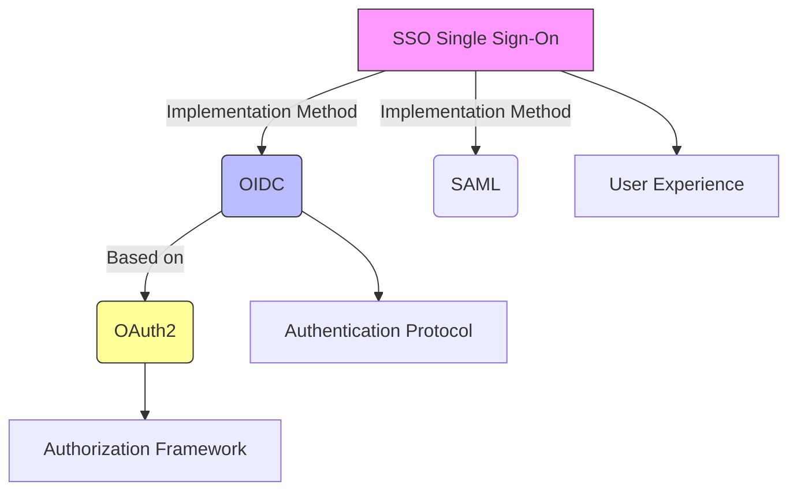
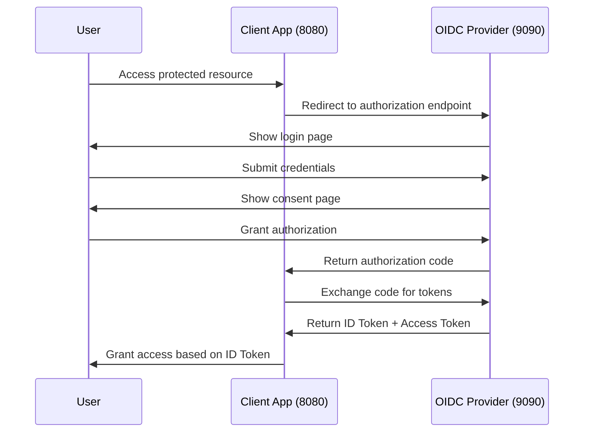

# OIDC Provider Demo - Authentication Server

## Overview
This is a minimal, self-contained OpenID Connect (OIDC) Provider implementation for local development and demonstration. It replaces external authentication services like Google or Okta for testing purposes.

## Architecture & Core Concepts

### OIDC vs OAuth2 vs SSO Relationship


### Key Differences Table
| **Feature**       | **OAuth2**                          | **OIDC**                                | **SSO**                     |
|-------------------|-------------------------------------|-----------------------------------------|-----------------------------|
| **Purpose**       | Resource access authorization       | User identity authentication            | Single login experience     |
| **Core Output**   | Access Token                        | ID Token + Access Token                 | Cross-system session state  |
| **Protocol Type** | RFC 6749 standard protocol          | OAuth2 extension layer                  | Implementation approach      |
| **User Info**     | No user identity information        | Standardized user info (claims)         | Depends on underlying protocol |

## Technical Implementation

### Core Endpoints
1. **Discovery Endpoint** (`/.well-known/openid-configuration`)
   - Tells clients where to find other endpoints
   - Returns JSON metadata about the OIDC provider

2. **JWKS Endpoint** (`/jwks.json`)
   - Provides public keys for JWT signature verification
   - Essential for token validation security

3. **Authorization Endpoint** (`/authorize`)
   - Entry point for user login and authorization
   - Implements OAuth2 authorization code flow

4. **Token Endpoint** (`/token`)
   - Exchanges authorization code for tokens
   - Returns both Access Token and ID Token (OIDC extension)

### Authentication Flow


## Quick Start

### Prerequisites
- Go 1.21 or higher
- No external dependencies required (uses in-memory storage)

### Installation & Run
```bash
cd simple-oidc-provider
go mod tidy
go run main.go
```

The server will start on `http://127.0.0.1:9090`

### Default Configuration
- **Client ID**: `my-client-app`
- **Client Secret**: `my-client-secret`
- **Redirect URI**: `http://127.0.0.1:8080/auth/callback`
- **Test User**: 
  - Username: `demo`
  - Password: `password`

## Key Features Demonstrated

### 1. OAuth2 Authorization Framework
- Authorization code flow implementation
- Client credential validation
- Secure token exchange

### 2. OIDC Identity Layer
- **ID Token Generation**: JWT format with user claims
- **Standardized Claims**: 
  ```json
  {
    "iss": "http://127.0.0.1:9090",
    "sub": "user-123",
    "aud": "my-client-app",
    "exp": 1640995200,
    "iat": 1640991600,
    "name": "Demo User",
    "email": "demo.user@example.com",
    "picture": "https://www.gravatar.com/avatar/?d=mp"
  }
  ```

### 3. SSO Foundation
- Centralized authentication service
- Session state management
- Cross-domain identity propagation

## Security Features

### JWT Signing
- Uses RSA-256 (RS256) algorithm
- 2048-bit RSA key pair generation
- Public key exposure via JWKS endpoint

### Token Security
- Authorization codes are single-use
- 5-minute expiration for auth codes
- 1-hour expiration for ID tokens
- Secure client credential validation

## API Endpoints Reference

| Endpoint | Method | Purpose | Response |
|----------|--------|---------|----------|
| `/.well-known/openid-configuration` | GET | OIDC Discovery | Provider metadata |
| `/jwks.json` | GET | Public Keys | JWK Set for token verification |
| `/authorize` | GET | Start Auth Flow | Redirect to login |
| `/token` | POST | Token Exchange | ID Token + Access Token |
| `/login` | GET/POST | User Authentication | Login form / Process login |
| `/consent` | GET/POST | User Consent | Consent form / Process consent |

## Development Notes

### In-Memory Storage
This demo uses in-memory storage for:
- User accounts (`users` map)
- Client registrations (`clients` map)
- Authorization codes (`authCodes` map)

### Production Considerations
For production use, replace with:
- Database storage for users and clients
- Redis/database for authorization codes
- Proper password hashing (bcrypt)
- HTTPS enforcement
- Rate limiting
- Comprehensive logging

## Testing the Provider

### Manual Testing
1. Start the provider: `go run main.go`
2. Visit discovery endpoint: `http://127.0.0.1:9090/.well-known/openid-configuration`
3. Check JWKS endpoint: `http://127.0.0.1:9090/jwks.json`

### Integration Testing
Use with the companion client demo in `../oidc-client-demo/` to test the complete OIDC flow.

## Educational Value

This implementation demonstrates:
- **OAuth2 Foundation**: How authorization codes and tokens work
- **OIDC Extension**: How identity information is standardized
- **SSO Enablement**: How centralized authentication enables single sign-on
- **JWT Security**: How tokens are created, signed, and verified
- **Protocol Standards**: Real-world implementation of OIDC specifications

Perfect for understanding the relationship between OAuth2 (authorization), OIDC (authentication), and SSO (user experience).
