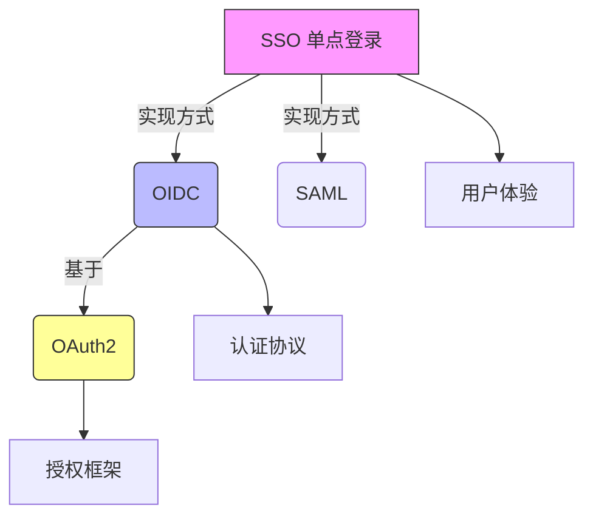
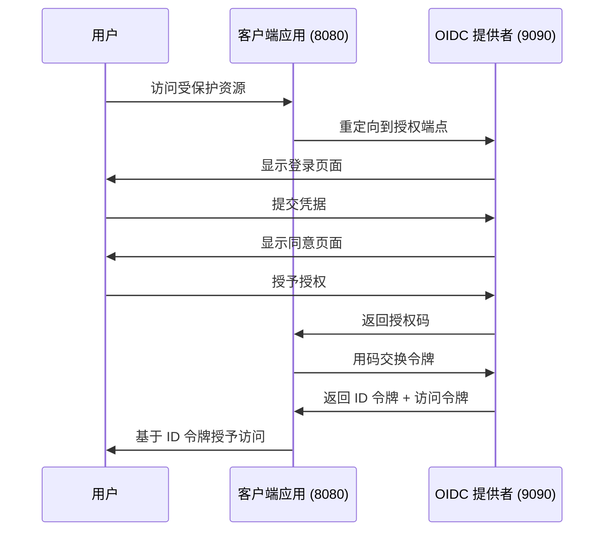
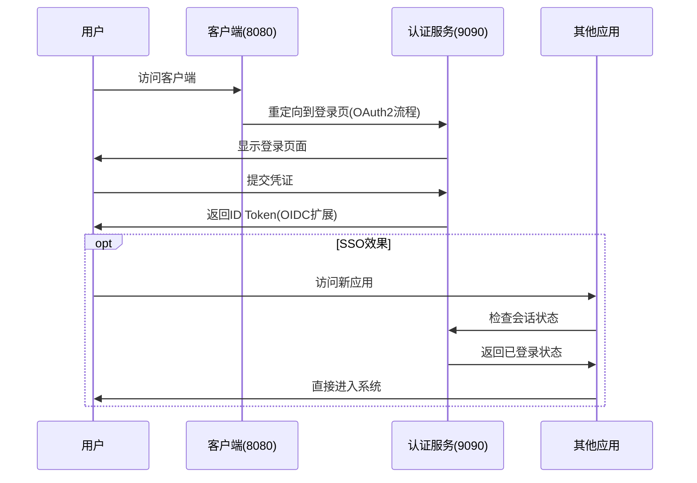

# OIDC 提供者演示 - 认证服务器

## 概述
这是一个迷你的、自包含的 OpenID Connect (OIDC) 提供者实现，用于本地开发和演示。它替代了像 Google 或 Okta 这样的外部认证服务进行测试。

## 架构和核心概念

### OIDC vs OAuth2 vs SSO 关系


### 关键区别表格
| **特性**       | **OAuth2**                          | **OIDC**                                | **SSO**                     |
|----------------|-------------------------------------|-----------------------------------------|-----------------------------|
| **目的**       | 资源访问授权                        | 用户身份认证                            | 单次登录体验                |
| **核心产出**   | Access Token                        | ID Token + Access Token                 | 跨系统会话状态              |
| **协议类型**   | RFC 6749 标准协议                   | OAuth2 扩展层                           | 实现方案                    |
| **用户信息**   | 不提供用户身份信息                  | 标准化用户信息（声明）                  | 依赖底层协议                |

## 技术实现

### 核心端点
1. **发现端点** (`/.well-known/openid-configuration`)
   - 告诉客户端其他端点的位置
   - 返回关于 OIDC 提供者的 JSON 元数据

2. **JWKS 端点** (`/jwks.json`)
   - 提供用于 JWT 签名验证的公钥
   - 对令牌验证安全性至关重要

3. **授权端点** (`/authorize`)
   - 用户登录和授权的入口点
   - 实现 OAuth2 授权码流程

4. **令牌端点** (`/token`)
   - 将授权码交换为令牌
   - 返回访问令牌和 ID 令牌（OIDC 扩展）

### 认证流程


## 快速开始

### 前置条件
- Go 1.21 或更高版本
- 无需外部依赖（使用内存存储）

### 安装和运行
```bash
cd simple-oidc-provider
go mod tidy
go run main.go
```

服务器将在 `http://127.0.0.1:9090` 启动

### 默认配置
- **客户端 ID**：`my-client-app`
- **客户端密钥**：`my-client-secret`
- **重定向 URI**：`http://127.0.0.1:8080/auth/callback`
- **测试用户**：
  - 用户名：`demo`
  - 密码：`password`

## 演示的关键特性

### 1. OAuth2 授权框架
- 授权码流程实现
- 客户端凭据验证
- 安全令牌交换

### 2. OIDC 身份层
- **ID 令牌生成**：包含用户声明的 JWT 格式
- **标准化声明**：
  ```json
  {
    "iss": "http://127.0.0.1:9090",
    "sub": "user-123",
    "aud": "my-client-app",
    "exp": 1640995200,
    "iat": 1640991600,
    "name": "演示用户",
    "email": "demo.user@example.com",
    "picture": "https://www.gravatar.com/avatar/?d=mp"
  }
  ```

### 3. SSO 基础
- 集中式认证服务
- 会话状态管理
- 跨域身份传播

## 安全特性

### JWT 签名
- 使用 RSA-256 (RS256) 算法
- 2048 位 RSA 密钥对生成
- 通过 JWKS 端点公开公钥

### 令牌安全
- 授权码是一次性的
- 授权码 5 分钟过期
- ID 令牌 1 小时过期
- 安全的客户端凭据验证

## API 端点参考

| 端点 | 方法 | 目的 | 响应 |
|------|------|------|------|
| `/.well-known/openid-configuration` | GET | OIDC 发现 | 提供者元数据 |
| `/jwks.json` | GET | 公钥 | 用于令牌验证的 JWK 集 |
| `/authorize` | GET | 开始认证流程 | 重定向到登录 |
| `/token` | POST | 令牌交换 | ID 令牌 + 访问令牌 |
| `/login` | GET/POST | 用户认证 | 登录表单 / 处理登录 |
| `/consent` | GET/POST | 用户同意 | 同意表单 / 处理同意 |

## 开发说明

### 内存存储
此演示使用内存存储：
- 用户账户（`users` 映射）
- 客户端注册（`clients` 映射）
- 授权码（`authCodes` 映射）

### 生产考虑事项
生产使用时，应替换为：
- 用户和客户端的数据库存储
- 授权码的 Redis/数据库
- 适当的密码哈希（bcrypt）
- HTTPS 强制执行
- 速率限制
- 全面的日志记录

## 测试提供者

### 手动测试
1. 启动提供者：`go run main.go`
2. 访问发现端点：`http://127.0.0.1:9090/.well-known/openid-configuration`
3. 检查 JWKS 端点：`http://127.0.0.1:9090/jwks.json`

### 集成测试
与 `../oidc-client-demo/` 中的配套客户端演示一起使用，测试完整的 OIDC 流程。

## 教育价值

此实现演示了：
- **OAuth2 基础**：授权码和令牌如何工作
- **OIDC 扩展**：身份信息如何标准化
- **SSO 启用**：集中式认证如何实现单点登录
- **JWT 安全**：令牌如何创建、签名和验证
- **协议标准**：OIDC 规范的实际实现

完美展示了 OAuth2（授权）、OIDC（认证）和 SSO（用户体验）之间的关系。

## 核心概念对比
| **特性**       | **OAuth2**                          | **OIDC**                                | **SSO**                     |
|----------------|-------------------------------------|-----------------------------------------|-----------------------------|
| **本质**       | 授权框架                            | 身份认证协议                            | 用户体验方案                |
| **主要目的**   | 资源访问授权                        | 用户身份认证                            | 一次登录访问多系统          |
| **关键产出**   | Access Token                        | ID Token + Access Token                 | 跨系统会话状态              |
| **协议类型**   | RFC 6749 标准协议                   | OAuth2 的扩展层                         | 实现方案（非协议）          |
| **用户信息**   | 不提供用户身份信息                  | 提供标准化用户信息(claims)              | 依赖底层协议                |

## 深度解析区别

### 1. OAuth2 (开放授权)
- **核心功能**：解决**资源访问授权**问题
- **典型流程**：
  ```mermaid
  sequenceDiagram
      User->>Client: 请求访问资源
      Client->>AuthServer: 重定向到授权页
      AuthServer->>User: 要求登录/授权
      User->>AuthServer: 同意授权
      AuthServer->>Client: 返回授权码
      Client->>AuthServer: 用授权码换Access Token
      Client->>ResourceServer: 用Token访问资源
  ```
- **演示体现**：认证服务的`/token`端点颁发access_token

### 2. OIDC (OpenID Connect)
- **本质**：OAuth2 + 身份认证层
- **关键创新**：
  - 标准化ID Token (JWT格式)
  - 用户信息端点(UserInfo Endpoint)
  - 发现机制(Discovery)
- **认证流程**：
  ```mermaid
  sequenceDiagram
      User->>RP: 请求登录
      RP->>OP: 携带OIDC参数重定向
      OP->>User: 认证用户身份
      OP->>RP: 颁发ID Token
      RP->>OP: 验证ID Token签名
      RP->>User: 建立认证会话
  ```
- **演示体现**：客户端验证ID Token的签名和声明(iss, aud, exp)

### 3. SSO (单点登录)
- **本质**：登录状态的共享方案
- **OIDC实现原理**：
  - 集中式认证服务(OP)
  - 共享会话状态(通过浏览器Cookie)
  - 跨域身份传递(ID Token)
- **演示体现**：用户登录认证服务后，访问其他注册同一OP的应用无需重新登录

### 协同工作流程（基于演示）


### 关键区别总结
1. **OAuth2 vs OIDC**
   - OAuth2回答：**"用户是否允许应用访问X资源？"**
   - OIDC回答：**"用户是谁？" + OAuth2的授权**
   - OIDC在OAuth2上增加：
     - 标准化的ID Token
     - 用户信息端点
     - 会话管理规范

2. **SSO与协议关系**
   - SSO是**目标**：一次登录，多系统访问
   - OIDC是**实现SSO的最佳实践**：
     - 通过集中式OP维护登录状态
     - 基于浏览器的会话传递
   - 传统SSO方案：Kerberos, SAML
   - 现代SSO方案：OIDC, Facebook Login

### 实际应用场景
| **场景**                | 推荐协议     | 原因                          |
|-------------------------|--------------|-------------------------------|
| 第三方API访问授权       | OAuth2       | 只需资源访问无需用户身份      |
| 用户登录系统            | OIDC         | 需要验证用户身份              |
| 企业多系统统一登录      | OIDC+SSO     | 最佳安全与用户体验组合        |
| 移动APP社交登录         | OIDC         | 标准化+用户信息获取           |

在我们的演示中：
- **OAuth2部分**：`/authorize`和`/token`端点
- **OIDC扩展**：ID Token包含用户信息(claims)
- **SSO实现**：通过OP维护全局会话状态

理解这三者的关系，关键在于：
- OAuth2是**基础授权框架**
- OIDC是**身份认证层**（构建在OAuth2之上）
- SSO是**用户体验目标**（通过OIDC/OAuth2实现）
